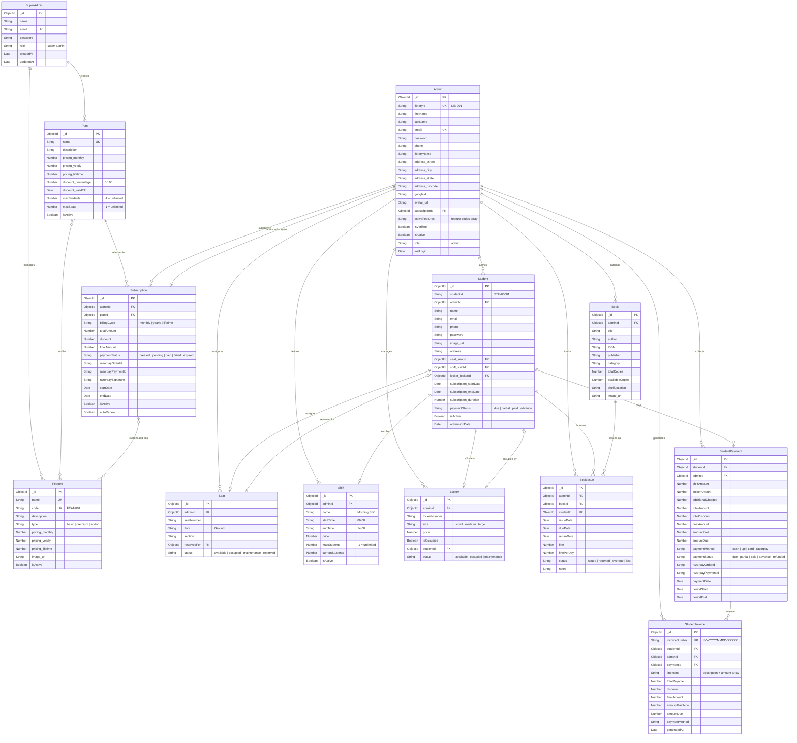

# Library Sathi — Entity Relationship Diagram

## Complete ER Diagram

---

## Relationship Summary

| Relationship | Type | Key |
|---|---|---|
| SuperAdmin → Feature | 1 : N | SuperAdmin manages features |
| SuperAdmin → Plan | 1 : N | SuperAdmin creates plans |
| Plan ↔ Feature | M : N | Plans bundle multiple features |
| Admin → Subscription | 1 : N | Admin can have subscription history |
| Plan → Subscription | 1 : N | Plan selected in subscriptions |
| Subscription ↔ Feature | M : N | Custom add-on features |
| **Admin → Student** | **1 : N** | **Tenant-scoped via `adminId`** |
| **Admin → Seat** | **1 : N** | **Tenant-scoped via `adminId`** |
| **Admin → Shift** | **1 : N** | **Tenant-scoped via `adminId`** |
| **Admin → Locker** | **1 : N** | **Tenant-scoped via `adminId`** |
| **Admin → Book** | **1 : N** | **Tenant-scoped via `adminId`** |
| Student → Seat | 1 : 0..1 | Optional seat assignment |
| Student → Shift | 1 : 0..1 | Optional shift enrollment |
| Student → Locker | 1 : 0..1 | Optional locker allocation |
| Student → StudentPayment | 1 : N | Multiple payment records |
| StudentPayment → StudentInvoice | 1 : N | Invoices per payment |
| Student → BookIssue | 1 : N | Multiple book borrows |
| Book → BookIssue | 1 : N | Multiple issue records |

> [!IMPORTANT]
> All **bold** relationships enforce **multi-tenant isolation** — every query on these entities MUST filter by `adminId` to prevent cross-library data leaks.
